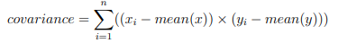

# Linear Regression


Linear regression assumes a linear or straight line relationship between the input variables (X)
and the single output variable (y). More specifically, that output (y) can be calculated from a
linear combination of the input variables (X). When there is a single input variable, the method
is referred to as a simple linear regression.

In simple linear regression we can use statistics on the training data to estimate the coefficients
required by the model to make predictions on new data. The line for a simple linear regression
model can be written as:

``` 
y = b0 + b1 × x
```


Where the i refers to the value of the ith value of the input x or output y.

### Calcualte Mean
 mean is average of values.

```
 Mean = Sum(x) / (count(x)) 
```


### Calcualte Variance

The variance is the sum squared difference for each value from the mean value. Variance for
a list of numbers can be calculated as:


### Calculate Covariance

The covariance of two groups of numbers describes how those numbers change together. Covariance is a generalization of correlation. Correlation describes the relationship between two
groups of numbers, whereas covariance can describe the relationship between two or more
groups of numbers. Additionally, covariance can be normalized to produce a correlation value.
Nevertheless, we can calculate the covariance between two variables as follows:



## Estimating coefficients

We must estimate the values for two coefficients in simple linear regression. The first is B1 which
can be estimated as:


We can simplify this arithmetic to:


# Multivariate Linear Regression 

Linear regression is a technique
where a straight line is used to model the relationship between input and output values. In
more than two dimensions, this straight line may be thought of as a plane or hyperplane.

Predictions are made as a combination of the input values to predict the output value. Each
input attribute (x) is weighted using a coefficient (b), and the goal of the learning algorithm is
to discover a set of coefficients that results in good predictions (y).
```
y = b0 + b1 × x1 + b2 × x2 + ... 
```
Coefficients can be found using stochastic gradient descent.

##  Stochastic Gradient Descent

Gradient Descent is the process of minimizing a function following the slope or gradient of
that function. In machine learning, we can use a technique that evaluates and updates the
coefficients every iteration called stochastic gradient descent to minimize the error of a model
on our training data

The way this optimization algorithm works is that each training instance is shown to the
model one at a time. The model makes a prediction for a training instance, the error is calculated
and the model is updated in order to reduce the error for the next prediction. This process is
repeated for a fixed number of iterations.

This procedure can be used to find the set of coefficients in a model that result in the smallest
error for the model on the training data. Each iteration, the coefficients (b) in machine learning
language are updated using the equation:
```
b = b − learning rate × error × x
```
Where b is the coefficient or weight being optimized, learning rate is a learning rate that
you must configure (e.g. 0.01), error is the prediction error for the model on the training data
attributed to the weight, and x is the input value.

### Estimating Coefficients

We can estimate the coefficient values for our training data using stochastic gradient descent.

Stochastic gradient descent requires two parameters:

ˆ Learning Rate: Used to limit the amount that each coefficient is corrected each time it
is updated.

ˆ Epochs: The number of times to run through the training data while updating the
coefficients.


These, along with the training data will be the arguments to the function. There are 3 loops
we need to perform in the function:
1. Loop over each epoch.
2. Loop over each row in the training data for an epoch.
3. Loop over each coefficient and update it for a row in an epoch.

As you can see, we update each coefficient for each row in the training data, each epoch.
Coefficients are updated based on the error the model made. The error is calculated as the
difference between the prediction made with the candidate coefficients and the expected output
value.
```
error = prediction − expected
```
There is one coefficient to weight each input attribute, and these are updated in a consistent
way, 

for example:
```
b1(t + 1) = b1(t) − learning rate × error(t) × x1(t)
```
The special coefficient at the beginning of the list, also called the intercept or the bias, is
updated in a similar way, except without an input as it is not associated with a specific input
value:
```
b0(t + 1) = b0(t) − learning rate × error(t)
```

```python
# Estimate linear regression coefficients using stochastic gradient descent
def coefficients_sgd(train, l_rate, n_epoch):
    coef = [0.0 for i in range(len(train[0]))]
    for epoch in range(n_epoch):
        sum_error = 0
        for row in train:
            yhat = predict(row, coef)
            error = yhat - row[-1]
            sum_error += error**2
            coef[0] = coef[0] - l_rate * error
            for i in range(len(row)-1):
                coef[i + 1] = coef[i + 1] - l_rate * error * row[i]
        print('>epoch=%d, lrate=%.3f, error=%.3f' % (epoch, l_rate, sum_error))
    return coef

```
Error continues to drop even in the final epoch. We could probably train for
a lot longer (more epochs) or increase the amount we update the coefficients each epoch (higher
learning rate).
