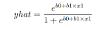
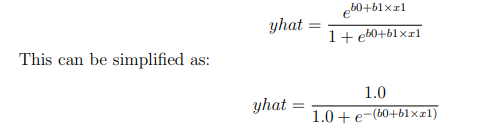
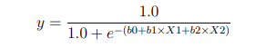

#  Logistic Regression

Logistic regression is named for the function used at the core of the method, the logistic function.
Logistic regression uses an equation as the representation, very much like linear regression.
Input values (X) are combined linearly using weights or coefficient values to predict an output
value (y). A key difference from linear regression is that the output value being modeled is a
binary value (0 or 1) rather than a numeric value.






Where e is the base of the natural logarithms (Euler’s number), yhat is the predicted output,
b0 is the bias or intercept term and b1 is the coefficient for the single input value (x1).

The yhat prediction is a real value between 0 and 1 that needs to be rounded to an integer value
and mapped to a predicted class value.

Each column in your input data has an associated b coefficient (a constant real value) that
must be learned from your training data. The actual representation of the model that you
would store in memory or in a file is the coefficients in the equation (the beta value or b’s). The
coefficients of the logistic regression algorithm must be estimated from your training data

## Stochastic Gradient Descent

Logistic Regression uses gradient descent to update the coefficients.

Each gradient descent iteration, the coefficients (b)
in machine learning language are updated using the equation:

```
b = b + learning rate × (y − yhat) × yhat × (1 − yhat) × x
```
Where b is the coefficient or weight being optimized, learning rate is a learning rate that
you must configure (e.g. 0.01),


 (y - yhat) is the prediction error for the model on the training
data attributed to the weight, yhat is the prediction made by the coefficients and x is the input
value.


The first step is to develop a function that can make predictions. This will be needed both
in the evaluation of candidate coefficient values in stochastic gradient descent and after the
model is finalized and we wish to start making predictions on test data or new data.

Below is a
function named predict() that predicts an output value for a row given a set of coefficients.
The first coefficient in is always the intercept, also called the bias or b0 as it is standalone and
not responsible for a specific input value.

```python
# Make a prediction with coefficients
def predict(row, coefficients):
yhat = coefficients[0]
for i in range(len(row)-1):
yhat += coefficients[i + 1] * row[i]
return 1.0 / (1.0 + exp(-yhat))

```
There are two inputs values (X1 and X2) and three coefficient values (b0, b1 and b2). The
prediction equation we have is:




### Estimating Gradient

We can estimate the coefficient values for our training data using stochastic gradient descent.
Stochastic gradient descent requires two parameters:

ˆ Learning Rate: Used to limit the amount each coefficient is corrected each time it is
updated.

ˆ Epochs: The number of times to run through the training data while updating the
coefficients.

These, along with the training data will be the arguments to the function. There are 3 loops
we need to perform in the function:
1. Loop over each epoch.
2. Loop over each row in the training data for an epoch.
3. Loop over each coefficient and update it for a row in an epoch.

As you can see, we update each coefficient for each row in the training data, each epoch.
Coefficients are updated based on the error the model made. The error is calculated as the
difference between the expected output value and the prediction made with the candidate
coefficients. 

There is one coefficient to weight each input attribute, and these are updated in a
consistent way, for example:
```
b1(t + 1) = b1(t) + learning rate × (y(t) − yhat(t)) × yhat(t) × (1 − yhat(t)) × x1(t)
```

The special coefficient at the beginning of the list, also called the intercept, is updated in a
similar way, except without an input as it is not associated with a specific input value:
```
b0(t + 1) = b0(t) + learning rate × (y(t) − yhat(t)) × yhat(t) × (1 − yhat(t)) 
```

```python

# Estimate logistic regression coefficients using stochastic gradient descent
def coefficients_sgd(train, l_rate, n_epoch):
    coef = [0.0 for i in range(len(train[0]))]
    for epoch in range(n_epoch):
        sum_error = 0
        for row in train:
            yhat = predict(row, coef)
            error = row[-1] - yhat
            sum_error += error**2
            coef[0] = coef[0] + l_rate * error * yhat * (1.0 - yhat)
        for i in range(len(row)-1):
            coef[i + 1] = coef[i + 1] + l_rate * error * yhat * (1.0 - yhat) * row[i]
        print('>epoch=%d, lrate=%.3f, error=%.3f' % (epoch, l_rate, sum_error))
    return coef

```

#### Kaggle notebook

A brief implementation of Logistic Regression
 
https://www.kaggle.com/prashant111/logistic-regression-classifier-tutorial
