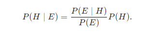
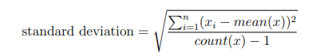
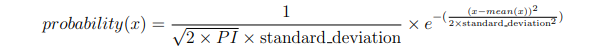

# Bayes' theorem 

It is a formula that describes how to update the probabilities of hypotheses when given evidence. It follows simply from the axioms of conditional probability, but can be used to powerfully reason about a wide range of problems involving belief updates.

### Statement : Given a hypothesis HH and evidence EE, Bayes' theorem states that the relationship between the probability of the hypothesis before getting the evidence P(H)P(H) and the probability of the hypothesis after getting the evidence P(H \mid E)P(H∣E) is :




# Naive Bayes

Bayes’ Theorem provides a way that we can calculate the probability of a piece of data belonging
to a given class, given our prior knowledge
```
P(class|data) = P(data|class) × P(class) / P(data)
```

Where P(class|data) is the probability of class given the provided data. Naive Bayes is
a classification algorithm for binary (two-class) and multiclass classification problems.

 It is
called Naive Bayes or idiot Bayes because the calculations of the probabilities for each class are
simplified to make their calculations tractable.


### Separate By Class

We will need to calculate the probability of data by the class they belong to. This means that
we will first need to separate our training data by class. A relatively straightforward operation.
We can create a dictionary object where each key is the class value and then add a list of all the
records as the value in the dictionary. Below is a function named separate by class() that
implements this approach. It assumes that the last column in each row is the class value.

``` python
# Split the dataset by class values, returns a dictionary
def separate_by_class(dataset):
    separated = dict()
    for i in range(len(dataset)):
        vector = dataset[i]
        class_value = vector[-1]
        if (class_value not in separated):
            separated[class_value] = list()
        separated[class_value].append(vector)
    return separated

```
### Summarize Dataset

``` 
mean = sum(x) / total_no(x)
```
Standard Deviation



```python
from math import sqrt
# Calculate the standard deviation of a list of numbers
def stdev(numbers):
    avg = mean(numbers)
    variance = sum([(x-avg)**2 for x in numbers]) / float(len(numbers)-1)
    return sqrt(variance)
```

Summarize Dataset
```python
# Calculate the mean, stdev and count for each column in a dataset
def summarize_dataset(dataset):
    summaries = [(mean(column), stdev(column), len(column)) for column in zip(*dataset)]
    del(summaries[-1])
    return summaries
```
>The first trick is the use of the zip() function that will aggregate elements from each
provided argument. We pass in the dataset to the zip() function with the * operator that
separates the dataset (that is a list of lists) into separate lists for each row. The zip() function
then iterates over each element of each row and returns a column from the dataset as a list of
numbers. A clever little trick.

We can put all of this together and summarize the columns in the dataset organized by class
values. Below is a function named summarize by class() that implements this operation. 

```python
def summarize_by_class(dataset):
    separated = separate_by_class(dataset)
    summaries = dict()
    for class_value, rows in separated.items():
        summaries[class_value] = summarize_dataset(rows)
    return summaries
```
## Gaussian Probability Density Function

Calculating the probability or likelihood of observing a given real-value like X1 is difficult. One
way we can do this is to assume that X1 values are drawn from a distribution, such as a bell
curve or Gaussian distribution.

A Gaussian distribution can be summarized using only two numbers: the mean and the
standard deviation. Therefore, with a little math, we can estimate the probability of a given
value. This piece of math is called a Gaussian Probability Distribution Function (or Gaussian
PDF) and can be calculated as:



```python
# Calculate the Gaussian probability distribution function for x
def calculate_probability(x, mean, stdev):
    exponent = exp(-((x-mean)**2 / (2 * stdev**2 )))
    return (1 / (sqrt(2 * pi) * stdev)) * exponent
```

### Class Probabilities

Now it is time to use the statistics calculated from our training data to calculate probabilities
for new data. Probabilities are calculated separately for each class. This means that we first
calculate the probability that a new piece of data belongs to the first class, then calculate
probabilities that it belongs to the second class, and so on for all the classes. The probability
that a piece of data belongs to a class is calculated as follows:

```
P(class|data) = P(X|class) × P(class)
```
You may note that this is different from the Bayes Theorem described above. The division
have been removed to simplify the calculation. This means that the result is no longer strictly a
probability of the data belonging to a class. The value is still maximized, meaning that the
calculation for the class that results in the largest value is taken as the prediction. This is a
common implementation simplification as we are often more interested in the class prediction
rather than the probability.

The input variables are treated separately, giving the technique it’s name naive. For the
above example where we have 2 input variables, the calculation of the probability that a row
belongs to the first class 0 can be calculated as:

```
P(class = 0|X1, X2) = P(X1|class = 0) × P(X2|class = 0) × P(class = 0)
```
Now you can see why we need to separate the data by class value. The Gaussian Probability
Density function in the previous step is how we calculate the probability of a real value like
X1 and the statistics we prepared are used in this calculation.

```python
# Calculate the probabilities of predicting each class for a given row
def calculate_class_probabilities(summaries, row):
    total_rows = sum([summaries[label][0][2] for label in summaries])
    probabilities = dict()
    for class_value, class_summaries in summaries.items():
        probabilities[class_value] = summaries[class_value][0][2]/float(total_rows)
        for i in range(len(class_summaries)):
            mean, stdev, count = class_summaries[i]
            probabilities[class_value] *= calculate_probability(row[i], mean, stdev)
    return probabilities
```
